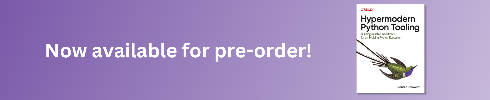

# 👋 Hi there, I'm Claudio Jolowicz

## Writing

- [Hypermodern Python Tooling](https://www.oreilly.com/library/view/hypermodern-python-tooling/9781098139575/) 2024-06-01
- [Hypermodern Python](https://cjolowicz.github.io/posts/hypermodern-python-01-setup/) 2020-01-01

## Open Source

I maintain these open-source projects:

<!-- [[[cog

repos = [
    "cjolowicz/cookiecutter-hypermodern-python",
]

for repo in repos:
    org, _, package = repo.partition("/")
    entry = f"""\
- [{package}](https://github.com/{repo}) &mdash;
  
  
"""
    cog.out(entry)

repos = [
    "theacodes/nox",
    "cjolowicz/nox-poetry",
    "cjolowicz/retrocookie",
]

for repo in repos:
    org, _, package = repo.partition("/")
    entry = f"""\
- [{package}](https://github.com/{repo}) &mdash;
  
  
  
"""
    cog.out(entry)

]]] -->
- [cookiecutter-hypermodern-python](https://github.com/cjolowicz/cookiecutter-hypermodern-python) &mdash;
  
  
- [nox](https://github.com/theacodes/nox) &mdash;
  
  
  
- [nox-poetry](https://github.com/cjolowicz/nox-poetry) &mdash;
  
  
  
- [retrocookie](https://github.com/cjolowicz/retrocookie) &mdash;
  
  
  
<!-- [[[end]]] -->

## Contact

Reach me on [Mastodon], [Twitter], [LinkedIn], or at mail (at) claudiojolowicz.com.

[Mastodon]: https://fosstodon.org/@cjolowicz
[Twitter]: https://twitter.com/cjolowicz
[LinkedIn]: https://linkedin.com/in/cjolowicz
